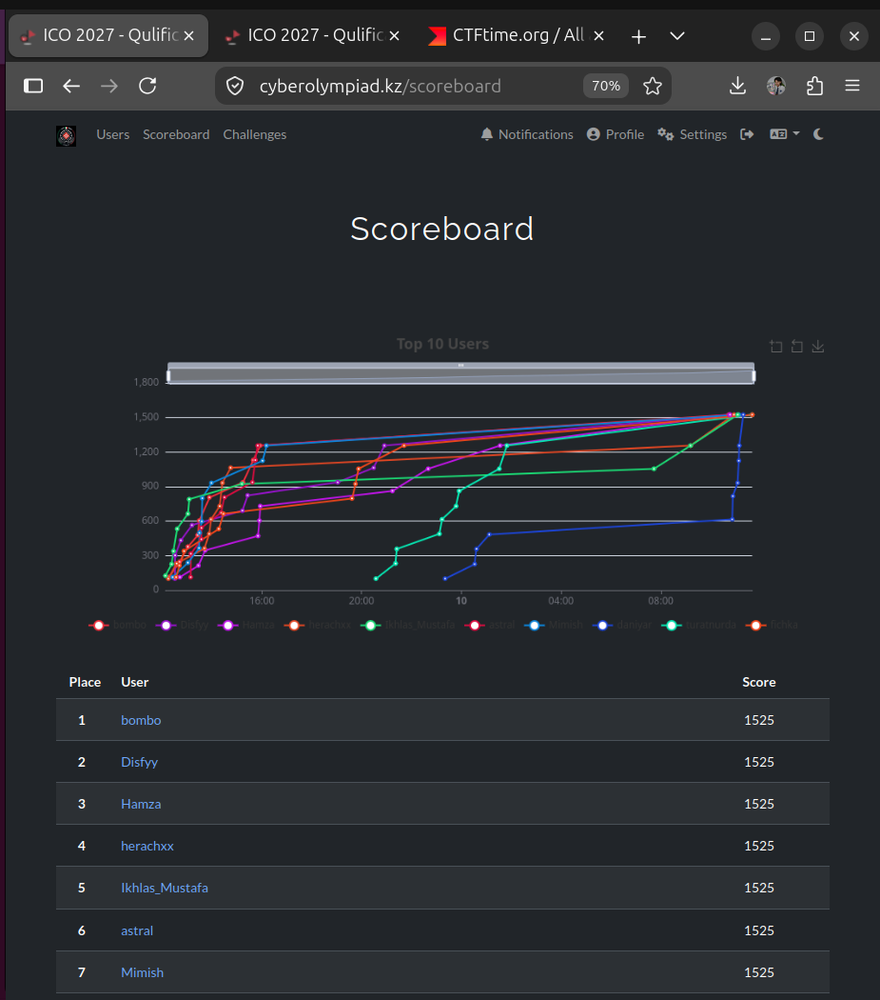
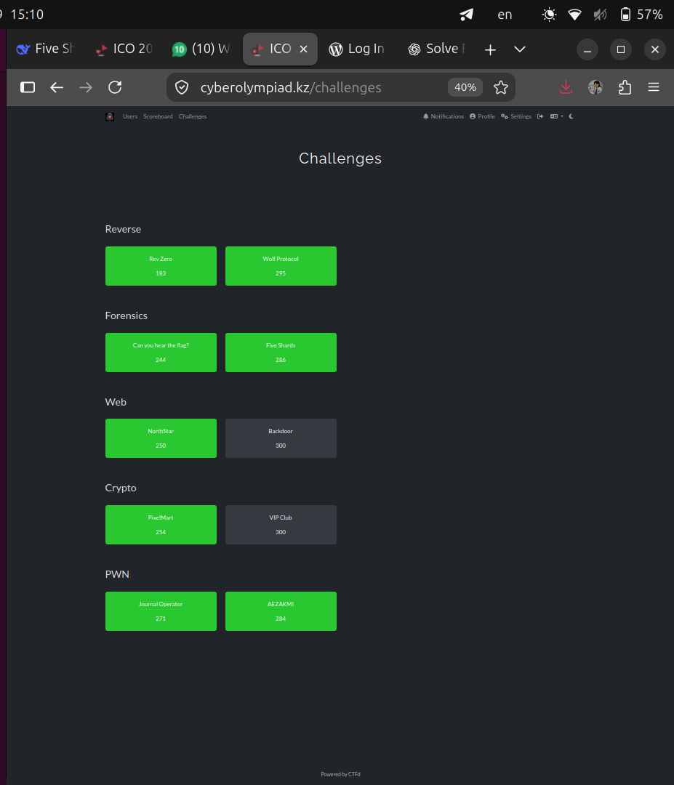
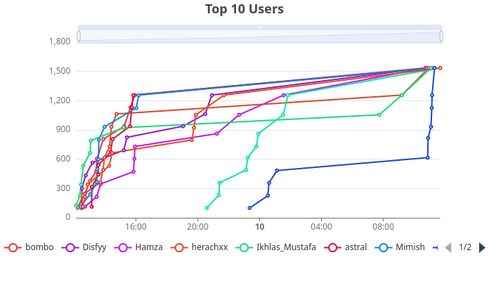
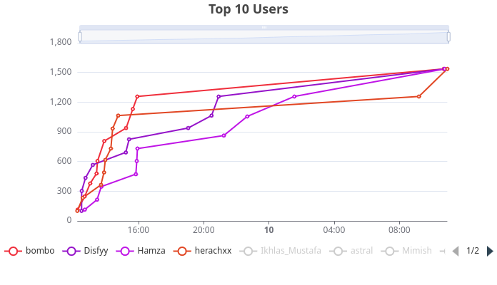

# ICO 2027 CTF Writeups

<p align="center">

International Cybersecurity Olympiad 2027 - Kazakhstan national qualifiers

  
  
  

  

</p>

---

## What this repo actually is

I'm Aruzhan ([@herachxx](https://github.com/herachxx)), and this is my writeup repo for **ICO 2027** - the International Cybersecurity Olympiad's Kazakhstan national selection. It's a CTF (more on what that even means below), run in two stages: an online qualifying round, then an in-person finals at KazHackStan where they pick the actual national team.

I finished the qualifying round **4th place**, 10/10 tasks solved. This repo is the full writeup of how - every command, every script, every "wait, why does this work" moment, explained so you don't need to already be a hacker to follow along. Finals haven't happened yet (they're **September 29-30, 2026**, in Astana), so that folder's still a placeholder for now.

---

## Proof it actually happened

Screenshots from the platform while the round was live, because "trust me" isn't a writeup.



*The live scoreboard mid-competition - that's me at 4th.*



*The challenge board itself, captured partway through - green means solved. (Backdoor and VIP Club were still unsolved at this exact moment; got both eventually.)*



*Everyone in the top 10, score-over-time. That's `herachxx` - me - in there.*



*Same chart, filtered down to just the top 4, so you can actually see who was racing who.*

---

## Start here

| Round | Status | Writeup |
|---|---:|---|
| ICO 2027 Qualifying Round | Complete, 10/10 tasks solved | [Open full writeup](./ico_qualifying_round/ico_ctf_writeup.md) |
| ICO 2027 Finals | Not happened yet (Sept 29-30, 2026) | [Open finals folder](./ico_finals/) |

Also worth a look: [`ico_qualifying_round/RULES.md`](./ico_qualifying_round/RULES.md) - the actual competition rules and timeline, cleaned up from the organizers' Telegram announcements into something readable. Has the finals AI policy in it too, which matters if you're prepping for one of these.

---

## Qualifying round tasks

| # | Task | Category | Result |
|---:|---|---|---|
| 1 | Rev Zero | Reverse Engineering | Solved |
| 2 | Wolf Protocol | Reverse Engineering | Solved |
| 3 | Can you hear the flag? | Forensics | Solved |
| 4 | Five Shards | Forensics | Solved |
| 5 | NorthStar | Web | Solved |
| 6 | Backdoor | Web | Solved |
| 7 | PixelMart | Crypto / Scripting | Solved |
| 8 | VIP Club | Crypto / Hash Length Extension | Solved |
| 9 | Journal Operator | Pwn | Solved |
| 10 | AEZAKMI | Pwn | Solved |

Full breakdown of each one is in the writeup linked above. The actual downloadable challenge files (binaries, the stego image, the Five Shards bundle, etc.) aren't stored in this repo - see why and where to get them just below.

---

## Where the actual challenge files live

This repo holds the *writeup* - descriptions, code, explanations. The actual files each challenge hands you (binaries, images, a WAV, a pcap, etc.) live in one shared Google Drive folder instead, so the git repo itself stays small and fast to clone:

**[ICO2027 - Google Drive folder](https://drive.google.com/drive/folders/1pKuyT6qqqxKOCK9oq7Dl5VGQzTkIW_ZW)**

The writeup links to that same folder right under each challenge's "Challenge file(s)" line, so you don't have to go hunting - just open the challenge you're reading about and the link's right there.

---

## What's inside (the actual file map)

This repo isn't huge, but I know dropping into a random GitHub repo and going "okay but what IS any of this" is annoying. So here's genuinely every file and folder, explained:

```text
ico-2027/
├── README.md                    → you're reading it right now
├── LICENSE                      → MIT license, see below for what that means
├── .gitignore                   → tells git to ignore OS junk and Python's __pycache__
├── бибизяна.gif                 → a joke gif, see below, it's not that deep
│
├── ico_finals/
│   └── README.md                → placeholder, finals haven't happened yet
│
├── ico_qualifying_round/
│   ├── ico_ctf_writeup.md       → THE main writeup. Every task, step by step, bilingual (EN/RU)
│   ├── RULES.md                 → cleaned-up competition rules + timeline
│   ├── contest_scoreboard.png   → live scoreboard screenshot (shown above)
│   ├── challenges_board.png     → challenge dashboard screenshot (shown above)
│   ├── top_10_users.png         → leaderboard chart, top 10 (shown above)
│   ├── top_4_users.png          → leaderboard chart, top 4 (shown above)
│   │
│   └── tasks/
│       ├── *.webp                → one screenshot per challenge, showing the exact task description
│       │                           as it appeared on the platform. These are what the writeup embeds
│       │                           under each "### Challenge" header. (Descriptions only - the actual
│       │                           challenge files these describe are the Google Drive folder above.)
│       └── sha256_ext.py         → a from-scratch SHA-256 implementation I wrote to pull off the
│                                    length-extension attack in VIP Club. This one's mine, not something
│                                    the platform handed out, so it stays in the repo as source code.
│                                    Explained in full in the writeup's VIP Club section.
│
└── ICO_archived/
    ├── README.md                            → explains this folder specifically, read that one too
    ├── ICO 2026 - Rules.pdf                 → last year's (2026) official competition rules
    └── tasks/
        ├── Challenges - ... .pdf            → last year's full challenge list
        └── *.png                            → per-challenge screenshots from that platform
        (last year's actual challenge files are also on the Drive folder above - see
        ICO_archived/README.md for the full story on why this folder exists at all)
```

A few notes on that:

- **Every actual challenge file - this year's and last year's - lives on Drive now, not in git.** Some of last year's archive files are multiple gigabytes each, way past what a normal `git push` can handle, so keeping *everything* in one consistent place (Drive) instead of "small stuff in git, huge stuff elsewhere" made more sense than a split setup.
- Binaries you download from that Drive folder won't have execute permission by default - `chmod +x` them yourself before running (the writeup calls this out wherever it matters).
- `NorthStar`, `Backdoor`, `PixelMart`, and `VIP Club` never had downloadable files at all - they were **remote services** (a website or a `nc host port` connection), nothing to hand out. The writeup covers exactly how those were approached instead.
- **Heads up if this repo goes public:** the Drive folder needs to be set to "Anyone with the link → Viewer," otherwise the links in the writeup lead nowhere for anyone but me.

---

## What each thing at the top actually is

Quick, honest rundown since "every file explained" was the whole point here:

- **`README.md`** - this file. The front door.
- **`LICENSE`** - [MIT License](./LICENSE). In plain words: do whatever you want with this repo - copy it, learn from it, remix it, whatever - just don't remove my name from it and don't sue me if something in here breaks your computer. That's genuinely the entire deal.
- **`.gitignore`** - a tiny file that tells git "don't bother tracking these." Right now that's OS clutter (`.DS_Store` on Mac, `Thumbs.db` on Windows) and the `__pycache__/` folder Python creates if you import `sha256_ext.py` instead of just reading it.
- **`бибизяна.gif`** - genuinely just a funny gif I threw at the top of the README because it made me laugh mid-competition. The alt text (in Russian) roughly translates to "funny gif, kinda like a baboon freaking out, that's basically me." No deeper meaning, don't overthink it.

---

## Notes

`ICO` stands for `International Cybersecurity Olympiad`.

`CTF` stands for `Capture The Flag`. In cybersecurity competitions, a flag is a secret string hidden inside a challenge - usually something like `ico{some_text_here}`. The whole game is finding it, by picking apart files, programs, websites, network traffic, or whatever else the challenge hands you.

Everything in this repository is for educational CTF learning only. The techniques here are explained in the context of a legitimate, sanctioned competition - don't go pointing any of this at systems you don't own or don't have explicit permission to test.
